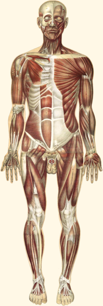

# ATLAS — AI Workout Companion

> **Live:** [ai-workout-companion.vercel.app](https://ai-workout-companion.vercel.app)
>
> A mobile-first, AI-grade fitness PWA. Not a static workout PDF. Not another rep counter. A *companion* — every move shows you the right tempo, the right tutorial video, the right intensity, and which muscles you actually trained.



---

## Why ATLAS is different

Most fitness apps are one of two things:

1. **A logbook** — you type numbers into rows.
2. **A workout PDF in HTML** — pictures + sets/reps with no intelligence.

ATLAS is built around **what your trainer would actually say to you mid-set**.

### 1. Real anatomical body map per training day


Tap into any training day and the top of the screen shows a **front + back view of the human body** rendered from Julien Bouglé's 1899 anatomical plates (public domain). Each muscle is highlighted by **training intensity** — Light → Moderate → Heavy → Peak — computed from every exercise's priority, primary muscle, and secondary muscle. You see at a glance: "today, side delts get hammered, lats are at rest."

### 2. Tempo notation that actually means something

Every exercise carries the exact lift-hold-lower seconds (or 4-phase for compound lifts like the leg press at `3-1-2-1`). The detail page splits it into colored rows with phase cues — no fitness jargon glossary required.

### 3. Curated YouTube Shorts tutorials, per variant

Every exercise has a **9:16 YouTube Shorts tutorial** lazy-loaded as the demo. Switch the variant (Dumbbell → Machine → Barbell) and the tutorial swaps too. Picked from credentialed fitness creators (DeltaBolic, ArielYu_Fit, Jeremy Ethier, etc.) and curated — not auto-suggested junk.

### 4. Warm-up videos + 30-second cool-down ring timer

Each training day starts with an embedded warm-up video. Each ends with a guided cool-down sequence — 30 seconds per stretch, auto-flips L → R for unilateral stretches, haptic buzz at zero, progress ring overlay so the timer is readable on any image.

### 5. Multi-variant equipment switching

Got dumbbells today? Or a leg press? Or just the hip thrust machine? Tap the variant chip — `DUMBBELL`, `LEG PRESS`, `MACHINE`, `BARBELL`, `SMITH`, `CABLE`, `BAND` — and the demo video + tempo + suggested weight all swap to that equipment's setup.

### 6. Everything is editable

Goals, body fat, pull-up status, suggested/current/goal weights per exercise, YouTube tutorial overrides — every field has a pencil icon → editor sheet → save. Stored locally in one localStorage doc. One "Reset all" wipes everything back to defaults.

### 7. Session history that comes from real logs

Each set you complete (weight, reps, difficulty, notes, side) gets stored. The session is auto-saved with total volume, sets, elapsed time. Open Settings → "View past sessions" to scrub through everything you've ever done.

### 8. Bilingual (EN + 中), PWA-installable, dark mode, kg / lb

Three toggles in Settings. Add to home screen on iOS and it acts like a native app — black-letter A icon, full screen, no browser chrome.

---

## Tech stack

| Layer | Choice | Why |
|---|---|---|
| Framework | **React 18 + Vite** | Instant HMR, tiny bundle (~108 KB gzip) |
| Styling | **Tailwind CSS** | Custom palette (bone/ink) matches Apple Fitness / Linear aesthetic |
| Animations | **Framer Motion** | Smooth cross-fades on muscle intensity, sheet transitions, ring countdowns |
| State | **localStorage + Context** | No backend — every byte stays on your device |
| i18n | **Custom** | Single `STRINGS` dict + `useT()`, ~200 keys for two languages |
| Hosting | **Vercel** | Static SPA, edge CDN, HTTPS, free tier |
| Anatomy assets | Bouglé 1899 plates (public domain) | Real anatomical illustrations, not robot silhouettes |

---

## Run it locally

```bash
git clone https://github.com/SkylarWJY/ai-workout-companion.git
cd ai-workout-companion
npm install
npm run dev
# → open http://localhost:5173
```

Production build:
```bash
npm run build
npm run preview
```

Deploy your own copy:
```bash
npx vercel        # one-time auth, then deploys instantly
```

---

## Project structure

```
src/
  components/
    Dashboard.jsx           — Today hero + weekly grid + goals
    WorkoutDay.jsx          — Active session screen
    BodyMap.jsx             — Anatomical overlay (hand-calibrated SVG paths)
    BodyMapSection.jsx      — Today's Hits card + intensity legend
    WarmUpSection.jsx       — Embedded video + alt YouTube
    CoolDownSection.jsx     — 30-second ring timer with L/R auto-flip
    ExerciseModal.jsx       — Detail sheet (demo + tempo + tutorial)
    ExerciseDemo.jsx        — Variant switcher + YouTube Shorts embed
    TempoBlock.jsx          — 3-phase + 4-phase tempo renderer
    WorkoutLogger.jsx       — Per-set logger
    RestTimer.jsx           — Ring countdown, vibration on done
    SessionHistorySheet.jsx — Past sessions browser
    SettingsSheet.jsx       — Lang / theme / unit / reset / history
    GoalsEditor.jsx         — Dashboard goals editor
    ExerciseEditor.jsx      — Per-exercise weight + YouTube override
  data/
    workoutData.js          — Push / Pull / Leg programs (20 exercises)
    demoMap.js              — Variant definitions + YouTube IDs
    exerciseMeta.js         — Tempo + tempo cues + default YouTube
    warmCoolData.js         — Warm-up + cool-down sequences
  hooks/
    useLocalStorage.js
    useRestTimer.js
    useTheme.js
    useOverrides.jsx        — Global user overrides + weight unit
  utils/
    muscleMap.js            — Muscle → body region + intensity scoring
    format.js               — Time / rest / repRange parsing
  i18n/
    strings.js              — All UI strings (EN + ZH)
    exercisesZh.js          — Per-exercise ZH translations
    exerciseMetaZh.js       — Tempo cue ZH translations
    warmCoolZh.js           — Stretch ZH translations
public/
  anatomy/                  — Bouglé 1899 plates (PD)
  warmup/                   — Warm-up MOV videos
  cooldown/                 — Cool-down stretch JPGs
  manifest.webmanifest      — PWA manifest
  icon.svg                  — App icon
```

---

## Credits

- **Anatomical illustrations** — Julien Bouglé, *Le corps humain en grandeur naturelle* (1899). Public domain via Wikimedia Commons.
- **Exercise demo images** (fallback) — [yuhonas/free-exercise-db](https://github.com/yuhonas/free-exercise-db), CC0.
- **Tutorial videos** — embedded from YouTube; credit to the individual creators on each thumbnail.
- **Cool-down stretches** — Verywell Fit (Standing Shoulder / Crescent Moon / Chest Opener); @fitzyelifts (leg recovery series).

---

## License

MIT. Use, fork, modify — just don't remove the credit to the anatomical plate creators.

---

## Roadmap

- [ ] Supabase backend for cross-device sync (currently localStorage-only)
- [ ] Apple Watch companion app
- [ ] Generate training programs from goals (currently a single PPL split)
- [ ] Weekly volume tracker per muscle group
- [ ] Body fat / weight progression chart on Dashboard
- [ ] PWA offline mode with service worker

PRs welcome.
