# ATLAS — AI Workout Companion

> **Live:** [ai-workout-companion.vercel.app](https://ai-workout-companion.vercel.app) · **Free · PWA · No login**

A mobile-first fitness app that actually knows what you're training.
Real 1899 anatomical body map painted with today's intensity, a separate
*Why-it-matters / How-to / Common-mistakes* guide for **every variant** of
every lift (machine ≠ dumbbell ≠ barbell — the modal swaps the whole text,
not just the video), an editorial **★ Best Pick** per primary muscle,
tempo coaching, warm-up & cool-down sequences, and per-set logging that
feeds a real history. All offline-first, no login.

一个真正懂你训练的移动健身 App。1899 年真实解剖图叠加当日训练强度；**每个变体都有独立的"为什么重要 / 动作要领 / 常见错误"指南**（器械、哑铃、杠铃发力本来就不一样，详情页里整套文字跟着 tab 换，不只是视频）；每块肌肉一个**橙色 ★ Best Pick** 编辑精选；节奏指导、暖身 / 拉伸视频、每组数据记录追溯历史 —— 全部本地优先，无需登录。

---

## ⚡ Quick start / 快速开始

```bash
git clone https://github.com/SkylarWJY/ai-workout-companion.git
cd ai-workout-companion
npm install
npm run dev
# → http://localhost:5173
```

**Or just open** [ai-workout-companion.vercel.app](https://ai-workout-companion.vercel.app) on your phone → Safari → Share → **Add to Home Screen**. Looks and feels like a native app.

**或者**直接在 iPhone Safari 打开 [ai-workout-companion.vercel.app](https://ai-workout-companion.vercel.app) → 分享 → **添加到主屏幕**。装好后跟原生 app 体感一样（黑底 A 图标 / 全屏 / 无浏览器栏）。

---

## 🚶 Walkthrough / 使用流程

### ① Dashboard — your starting point

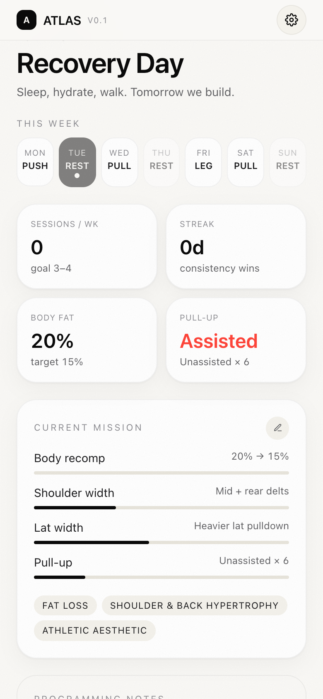

**EN.** The dashboard tells you what to train *today*. Big black CTA jumps you straight into the day's session. The 7-day grid below shows what's coming and which days you've completed (green dot). Stats tiles track sessions per week, current streak, body-fat progress, and pull-up status. Tap the pencil next to **Current Mission** to edit your goals — every number is overridable.

**中文.** 主页直接告诉你今天练什么。黑色大按钮一秒进入当日训练。下方 7 天周历显示这周安排和完成状态（绿点 = 完成）。再下方四个数据卡：每周训练次数 / 连续打卡 / 体脂进度 / 引体向上目标。点 **Current Mission** 旁的铅笔可以编辑所有目标 — 每个数值都能改。

<br clear="right"/>

### ② Workout Day — warm-up first

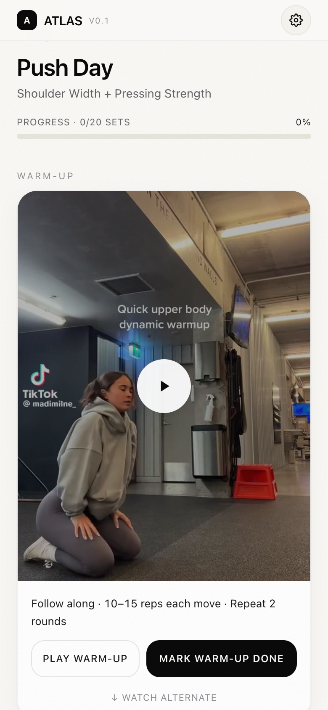

**EN.** Every training day starts with an embedded warm-up video (10-15 reps per move × 2 rounds for Push / Pull, 10 reps for Leg). Below it lives the **Today's Hits** anatomical body map. Tap **Mark warm-up done** when finished — the green check persists across the session.

Every exercise card in the **Full Session** list carries the **primary muscle** as a chip in the top-right (e.g. *Front Delts*, *Lat Width*, *Mid Back*, *Side Delts*) — so you can scan the day's targets without opening anything. The **REORDER** chip in the section header flips the list into edit mode where each row gets ↑ / ↓ tap buttons; the *Up Next* focus card recomputes off the new order, so dragging an exercise to the top makes it the next set to log. Persistence is per-workout and survives reloads.

**中文.** 每个训练日的最上方就是嵌入式暖身视频（推日 / 拉日：每个动作 10–15 次 × 2 轮；腿日：每个动作 10 次）。下方是**今日训练部位**人体解剖图。暖身做完后点 **MARK WARM-UP DONE**，状态会一直保留到训练结束。

**Full Session** 里每张动作卡片右上角都有一个**主练部位胶囊**（前束 · 背宽 · 中背 · 中束 等具体标签），不打开详情也能扫到今天每个动作主要练哪里。Section header 上的 **REORDER** 按钮把列表切换到编辑模式 — 每行右边变成 ↑ / ↓ 点按按钮；上方"当前"卡片会跟着新顺序刷新，把动作拖到最上面它就变成下一组要做的。顺序按训练日分别保存，重新打开也在。

<br clear="right"/>

### ③ Today's Hits — anatomical body map

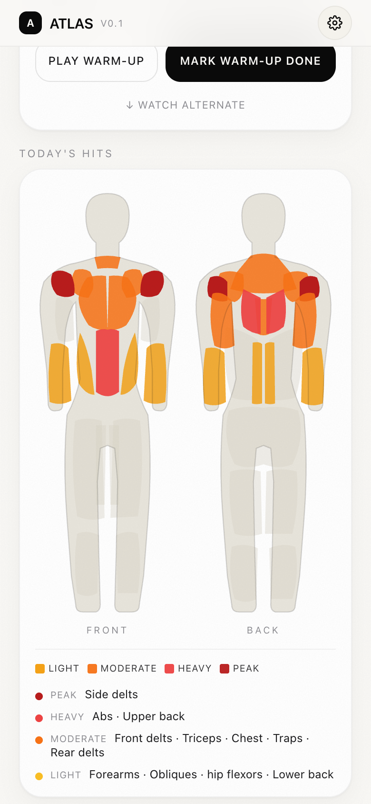

**EN.** A clean human silhouette (front + back) painted with today's training intensity — every muscle region is its own SVG path, hand-calibrated against anatomical landmarks. Each muscle is bucketed into 4 levels by exercise priority × primary/secondary contribution:
- 🟡 **Light** · 🟠 **Moderate** · 🔴 **Heavy** · ⛔ **Peak**

Below the figures is a grouped list — at a glance you know "today peaks side delts, hits abs + upper back heavy, light on lower back."

**中文.** 干净的人形剪影（正面 + 背面）叠加当日训练强度 — 每块肌肉是一个独立的 SVG 路径，按真实解剖标志手工标定。每块肌肉按优先级 × 主肌群/次肌群算分，分 4 级强度叠加红橙黄色块：
- 🟡 **轻** · 🟠 **中** · 🔴 **重** · ⛔ **极重**

下方按强度分组列出所有训练部位，一眼看清"今天极重打中束、重练腹肌和上背、轻碰下背"。

<br clear="right"/>

### ④ Exercise Detail — every variant is a different lift

<table>
<tr>
<td width="50%">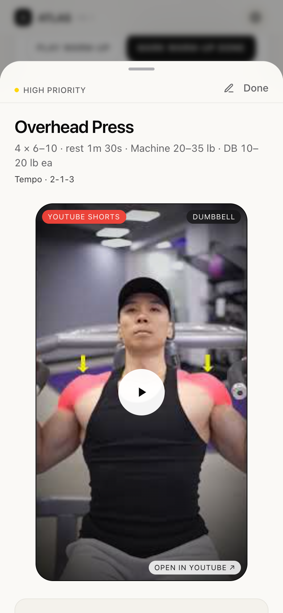
<sub><b>Default tab</b> — Overhead Press · Dumbbell guide</sub></td>
<td width="50%">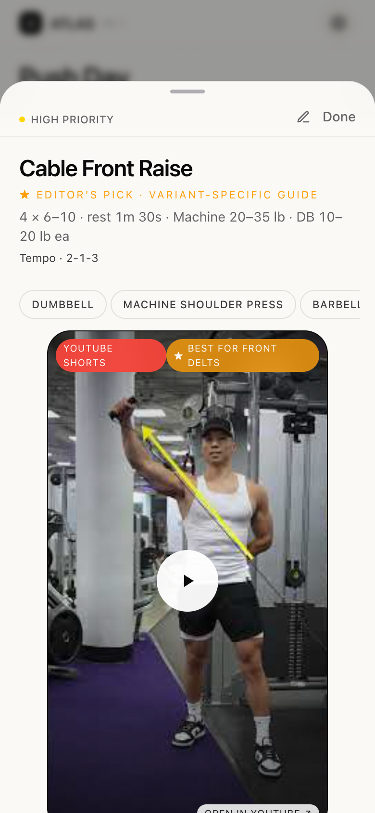
<sub><b>★ Best Pick</b> — swaps title + guide to Cable Front Raise</sub></td>
</tr>
</table>

**EN.** Every exercise card opens to a detail sheet. Top: priority chip + edit pencil + Done. Then a **9:16 YouTube Shorts tutorial** (lazy-loaded — tap to play). Above the video lives the **variant strip** — Dumbbell, Machine, Barbell, Cable, Rope, Kickback, whatever's available for this lift.

Tapping a chip swaps **the entire guide**, not just the video: title, primary muscles, *Why it matters*, the 4-step *How to perform*, *Form tips*, and *Common mistakes* all change. A barbell overhead press has a different setup than a machine press, so the modal reflects that — false-grip + head-through-the-window cues on the barbell tab, seat-height + thumbless-grip cues on the machine tab, no shared content fudging.

The **last chip in every list is the ★ Best Pick** (orange, `priority-veryhigh`) — an editorial "if you can only do one thing for this muscle" alternative. Front delts → Cable Front Raise. Side delts → Lean-Forward Lateral. Upper chest → Low-to-High Cable Fly. Triceps → Overhead Cable Extension. Abs → Cable Crunch. Lats → Pull-Up progression. Every Best Pick is sourced from the channels credited at the bottom and verified via YouTube oembed — no random TikTok fitness influencers, no slop.

**中文.** 任意动作卡片都能展开详情。顶部：优先级标签 + 编辑铅笔 + 完成。然后是 **9:16 YouTube Shorts 教学短视频**（懒加载，点了才播放）。视频上方是**变体切换条** — 哑铃、器械、杠铃、绳索、绳索 V 把、后踢，凡是这个动作有的都列出来。

点变体 tab 时**整套指南都换** — 不只是视频：标题、目标肌群、*为什么重要*、4 步*动作要领*、*技巧*、*常见错误*全部跟着切。杠铃过头推举和器械推举的发力本来就不一样，详情页直接体现：杠铃那一栏是假握 + 头穿过窗口的提示，器械那一栏是座椅高度 + 不握紧大拇指的提示，没有偷懒共用内容。

每个动作的**最后一个 tab 是橙色 ★ Best Pick**（`priority-veryhigh` 强调色）— 编辑精选"练这块肌肉如果只能选一个"的最优替代。前束 → 绳索前平举。中束 → 前倾侧平举。上胸 → 低位上斜绳索飞鸟。三头 → 头后绳索屈伸。腹肌 → 绳索卷腹。背阔 → 引体向上目标态。每个 Best Pick 都来自下方致谢的频道（DeltaBolic / Andrew Kwong、Jeremy Ethier、Booty Builder 等），全部通过 YouTube oembed 验证作者本人 — 不是随便搬运短视频，没有水货。

<br clear="right"/>

### ⑤ Tempo block — phase-by-phase coaching

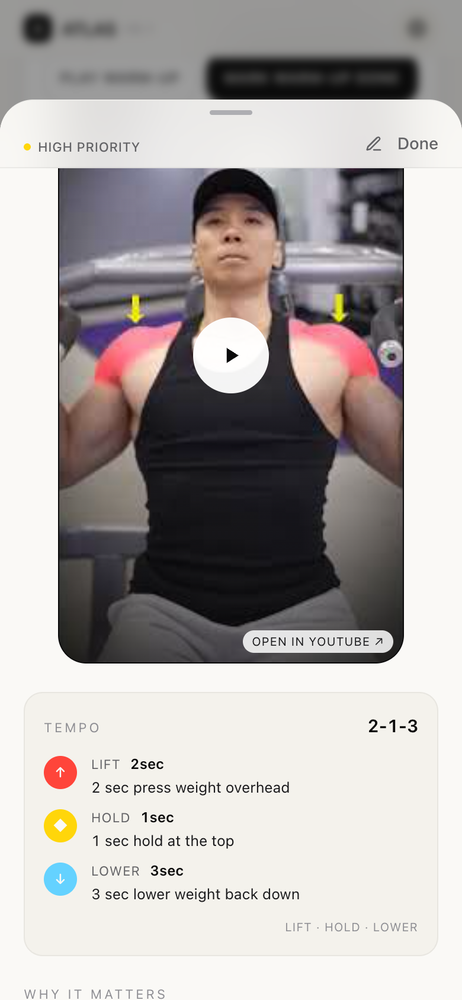

**EN.** Below the tutorial video, the **Tempo** block breaks down the lift into 3 phases (or 4 for compound lifts like leg press `3-1-2-1`):
- 🔴 **Lift** — concentric phase, seconds + cue text
- 🟡 **Hold** — top pause
- 🔵 **Lower** — controlled eccentric

Each row has color-coded icon + seconds + verbal coaching cue. No fitness jargon glossary required.

**中文.** 教学视频下方的 **节奏（Tempo）** 块把动作拆成 3 个阶段（compound 动作如腿举是 4 阶段 `3-1-2-1`）：
- 🔴 **发力** — 向心收缩，秒数 + 提示
- 🟡 **顶部停留**
- 🔵 **离心** — 控制下放

每行颜色 + 秒数 + 文字提示，不用再查健身术语。

<br clear="right"/>

### ⑥ Logger — record every set so you can dial in the load

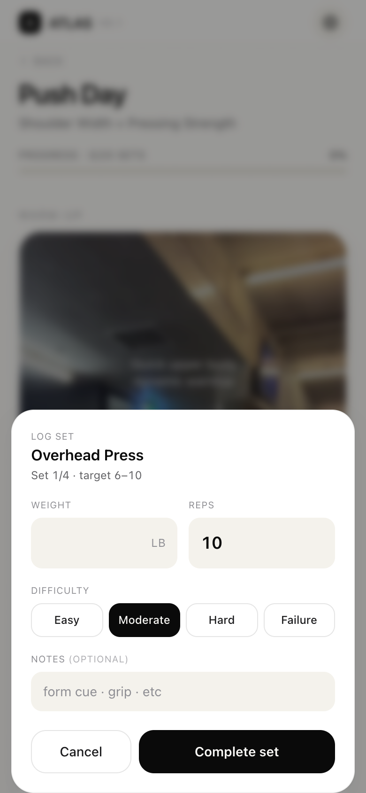

**EN.** Tap **COMPLETE SET** on the active card and a quick-entry sheet slides up. Log three things per set:
- **Weight** — in lb or kg (toggle in Settings)
- **Reps** — the number you actually hit, not the target
- **Difficulty** — Easy · Moderate · Hard · Failure

That last column is the unlock. After a few weeks every set you've ever done is on file in **Session History (⑨)**, so you can see *"I hit 25 lb × 12 'Easy' last Monday → bump to 30 lb today"* or *"shoulder press has been 'Hard' three sessions in a row → de-load 10%."* Progressive overload, but driven by data instead of guesswork.

**中文.** 在当前训练卡片上点 **COMPLETE SET**，会从底部弹出快速录入面板，每组记三件事：
- **重量** — lb 或 kg（设置里切换单位）
- **次数** — 你实际完成的，不是目标数
- **吃力程度** — 轻松 · 中等 · 吃力 · 力竭

最后一栏才是真正的杀手锏。练几周之后所有历史组都在 **训练历史 (⑨)** 里，你可以一眼看出 *"上周一 25 lb × 12 标了'轻松' → 今天加到 30 lb"* 或 *"肩推连续三次'吃力' → 减 10% 重量先稳定一下"*。**渐进超负荷**不再靠感觉，靠数据。

<br clear="right"/>

### ⑦ Cool-down — 30-second ring timer

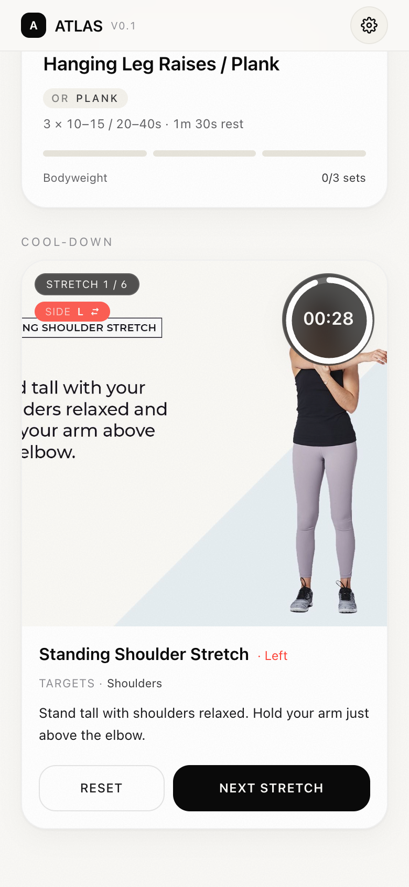

**EN.** After all sets, a guided cool-down sequence kicks in. Each stretch displays for **30 seconds with a circular countdown timer** in a dark backdrop pill (readable on any image). For unilateral stretches (kneeling hip flexor, pigeon, etc.), the red **Side L ⇄** chip auto-flips to **R** at 0 with a haptic buzz — you get 30s left, 30s right, then the **Next Stretch** button advances.

**中文.** 全部组完成后进入引导式拉伸。每个动作 **30 秒倒计时**，时间显示在深色磨砂胶囊里（任何底图都能看清）。单边动作（跪姿髂腰肌、鸽子式等）会自动 **左 → 右** 翻转，并伴随震动反馈 — 左侧 30 秒 → 自动跳到右侧 30 秒 → 然后按 **Next Stretch** 进入下一个。

<br clear="right"/>

### ⑧ Settings — gear icon top-right

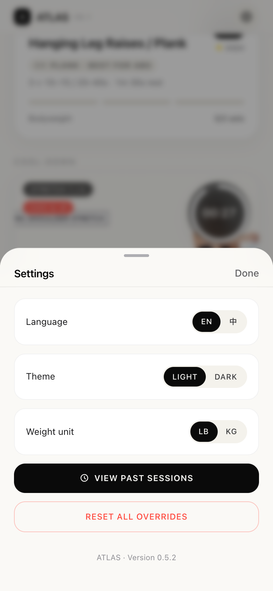

**EN.** Tap the gear icon (header right). The bottom-sheet has:
- **Language** — EN / 中
- **Theme** — Light / Dark
- **Weight unit** — lb / kg (applies to the Logger)
- **View past sessions** — opens session history
- **Reset all overrides** — wipes your custom goals + weights + video overrides back to defaults

**中文.** 点右上齿轮，底部弹出设置：
- **语言** — EN / 中
- **主题** — 浅色 / 深色
- **重量单位** — lb / kg（Logger 输入框跟着切）
- **查看历史训练** — 打开记录页
- **重置所有自定义** — 一键还原所有自定义编辑

<br clear="right"/>

### ⑨ Session History — every set you logged

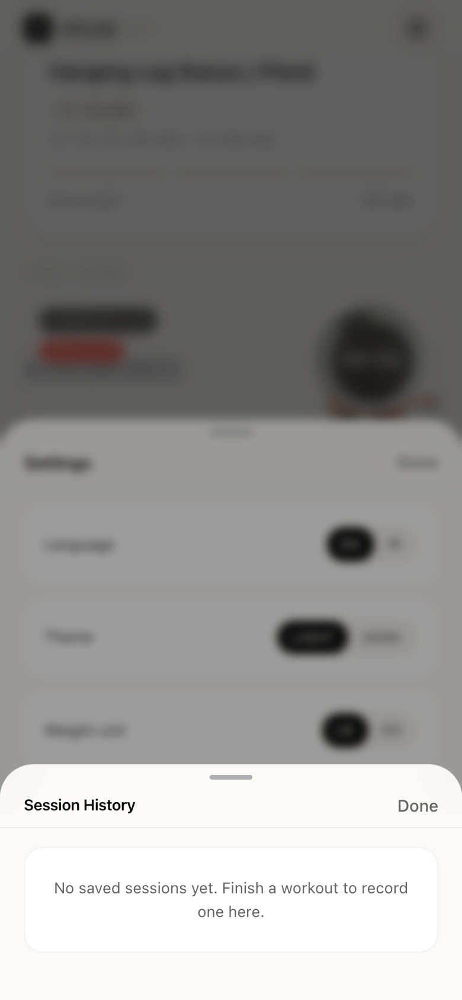

**EN.** Open Settings → **View past sessions**. Every completed workout shows as a card with date / workout name / sets done / total volume (lb·rep) / elapsed time. **Tap a card to expand** — you get the per-exercise breakdown with every logged set in `weight × reps (L/R)` format. Newest first.

(Screenshot shows the empty state before any session is saved.)

**中文.** 设置 → **查看历史训练**。完成的每次训练都是一个卡片：日期 / 训练名 / 完成组数 / 总容量 / 用时。**点卡片展开** — 每个动作每组的 `重量 × 次数 (L/R)` 全部展开。最新在最上。

（截图是空状态 — 还没保存训练时的样子。）

<br clear="right"/>

### ⑩ Bilingual — the entire app in 中文

<table>
<tr>
<td width="50%">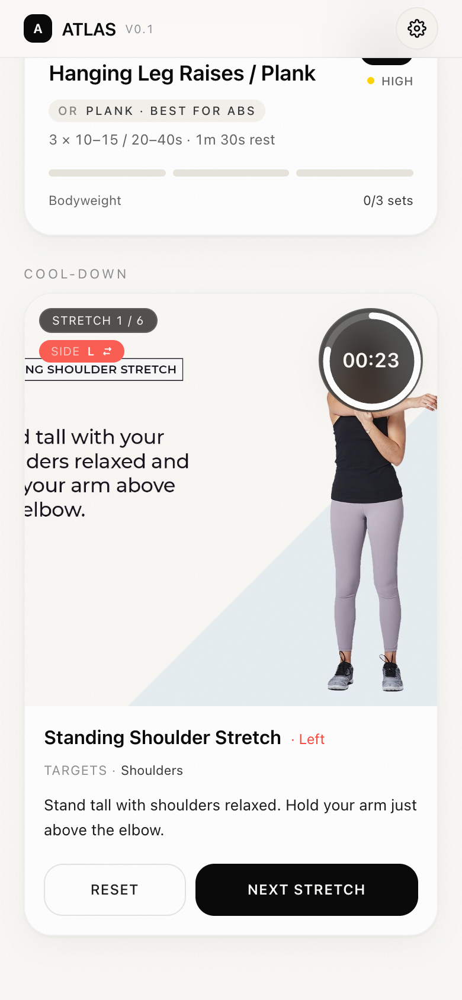</td>
<td width="50%">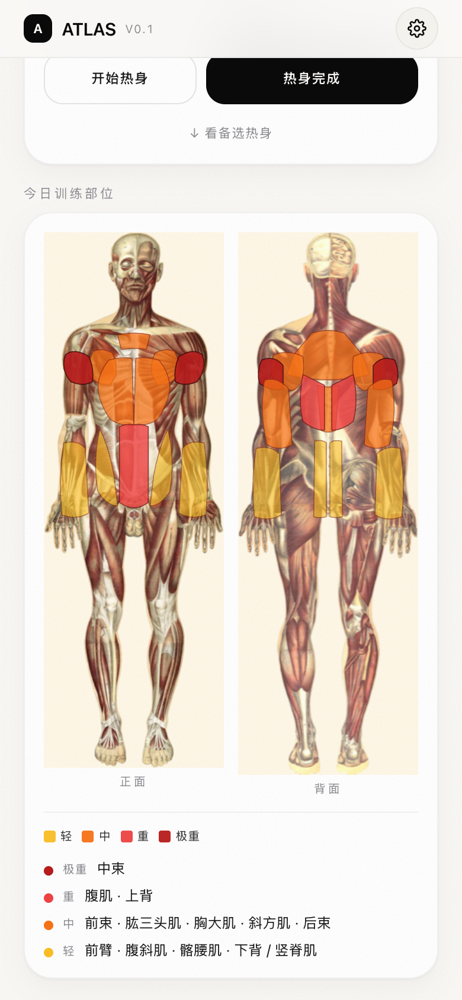</td>
</tr>
</table>

**EN.** Switch language in Settings — entire UI plus all exercise names, muscle groups, tempo cues, stretch descriptions, region labels, intensity levels are translated. (~200 keys across the i18n dict, all hand-curated, no machine translation.)

**中文.** 设置里切换语言 — 整个 UI 加上所有动作名称、肌群名、节奏提示、拉伸描述、部位标签、强度等级都翻译过。（i18n 字典约 200 个 key，全部手工翻译，没用机翻。）

---

## 🛠 Tech stack / 技术栈

| Layer / 层 | Choice / 选型 | Why / 为什么 |
|---|---|---|
| Framework | **React 18 + Vite** | Tiny bundle (~148 KB gzip) · HMR ~50ms |
| Styling | **Tailwind CSS** | Custom palette (bone/ink/priority colors) |
| Animations | **Framer Motion** | Sheet transitions · ring countdowns · cross-fades |
| State | **localStorage + React Context** | No backend · works offline · zero infra |
| i18n | **Custom** | `STRINGS` dict + `useT()` hook, 200+ keys |
| Hosting | **Vercel** | Static SPA · edge CDN · HTTPS · free |
| Anatomy | **Custom SVG silhouette** | Inline path, no images — dark-mode aware, MuscleWiki-style accent fills |

**Bundle size:** 148 KB gzip total (JS + CSS + HTML). Loads in under 1 second on 4G.

**包大小：** 总 148 KB gzip（JS + CSS + HTML）。4G 网络 1 秒内打开。

---

## 📁 Project structure / 项目结构

```
src/
  components/
    Dashboard.jsx           — Today hero + weekly grid + goals
    WorkoutDay.jsx          — Active session screen
    BodyMap.jsx             — Anatomical overlay (hand-calibrated SVG paths)
    BodyMapSection.jsx      — Today's Hits card + intensity legend
    WarmUpSection.jsx       — Embedded video + alt YouTube
    CoolDownSection.jsx     — 30s ring timer with L/R auto-flip
    ExerciseModal.jsx       — Detail sheet (demo + tempo + tutorial)
    ExerciseDemo.jsx        — Variant switcher + YouTube Shorts embed
    TempoBlock.jsx          — 3-phase + 4-phase tempo renderer
    WorkoutLogger.jsx       — Per-set logger
    RestTimer.jsx           — Ring countdown, vibration on done
    SessionHistorySheet.jsx — Past sessions browser
    SettingsSheet.jsx       — Lang / theme / unit / reset / history
    GoalsEditor.jsx         — Dashboard goals editor
    ExerciseEditor.jsx      — Per-exercise weight + YouTube override
  data/
    workoutData.js          — Push / Pull / Leg programs (20 exercises)
    demoMap.js              — Variant definitions + YouTube IDs
    exerciseMeta.js         — Tempo + tempo cues + default YouTube
    warmCoolData.js         — Warm-up + cool-down sequences
  hooks/
    useLocalStorage.js
    useRestTimer.js
    useTheme.js
    useOverrides.jsx        — Global user overrides + weight unit
  utils/
    muscleMap.js            — Muscle → body region + intensity scoring
    format.js               — Time / rest / repRange parsing
  i18n/
    strings.js              — UI strings (EN + ZH)
    exercisesZh.js          — Per-exercise ZH content
    exerciseMetaZh.js       — Tempo cue ZH
    warmCoolZh.js           — Stretch ZH
public/
  anatomy/                  — Bouglé 1899 plates
  warmup/                   — Warm-up MOV videos
  cooldown/                 — Cool-down stretch JPGs
  manifest.webmanifest      — PWA manifest
docs/
  screenshots/              — Screenshots used in this README
```

---

## 🚢 Deploy your own / 部署自己的副本

```bash
npx vercel        # one-time browser login, then deploys instantly
                  # 浏览器登录一次后秒部署
```

Vercel free tier covers it: 100 GB bandwidth/month, custom domain, HTTPS — all $0.

Vercel 免费版完全够：100 GB 月流量 + HTTPS + 自定义域名都 $0。

---

## 🙏 Credits / 致谢

- **Body map silhouette** — custom inline SVG (this repo, MIT). Anatomical landmarks calibrated by hand.
- **Exercise fallback images** — [yuhonas/free-exercise-db](https://github.com/yuhonas/free-exercise-db), CC0.
- **YouTube tutorials** — embedded from the original creators (DeltaBolic / Andrew Kwong, ArielYu_Fit, Jeremy Ethier, Nuffield Health, Colossus Fitness, Booty Builder, Gerardi Performance, and others). Credit displayed on each thumbnail.
- **Cool-down stretches** — Verywell Fit (shoulder/crescent moon/chest opener); @fitzyelifts (leg recovery series).

**人体剪影** — 本仓库手画 inline SVG（MIT 协议），解剖标志手工标定
**动作教学视频** — 嵌入自原作者频道，每个缩略图上有创作者名
**拉伸图** — Verywell Fit · @fitzyelifts

---

## 📜 License

**MIT.** Use, fork, modify, sell — just keep the original LICENSE file and credit the anatomical plate creators.

**MIT.** 随便用、fork、改、卖钱都行 — 只要保留原始 LICENSE 文件并致谢解剖图作者。

---

## 🗺 Roadmap / 路线图

- [ ] Supabase backend for cross-device sync / 后端云同步
- [ ] Apple Watch companion / Apple Watch 配套
- [ ] Generate programs from goals / AI 根据目标生成训练计划
- [ ] Weekly muscle-group volume chart / 周度肌群训练量图表
- [ ] BF / weight progression chart / 体脂体重进展图
- [ ] PWA offline service worker / PWA 离线 service worker

PRs welcome. Issues at [github.com/SkylarWJY/ai-workout-companion/issues](https://github.com/SkylarWJY/ai-workout-companion/issues).
