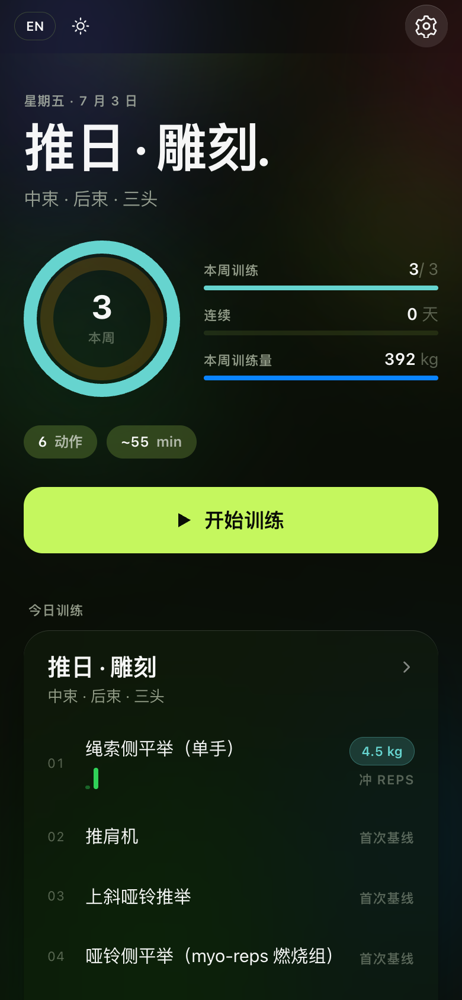
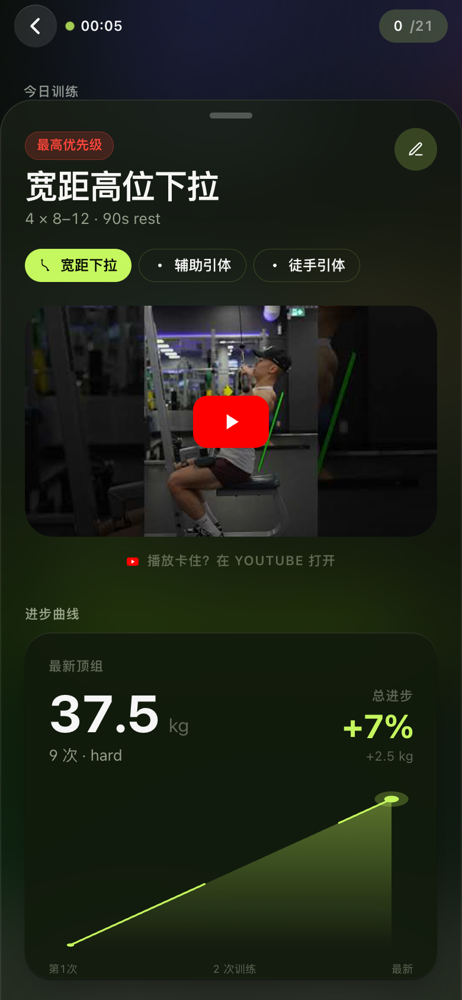
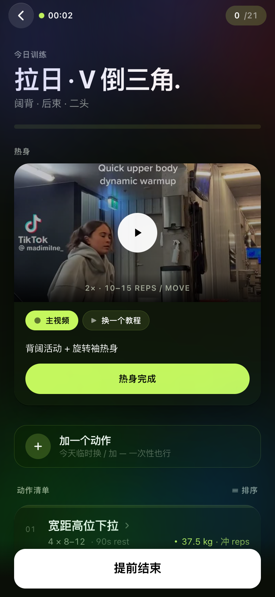
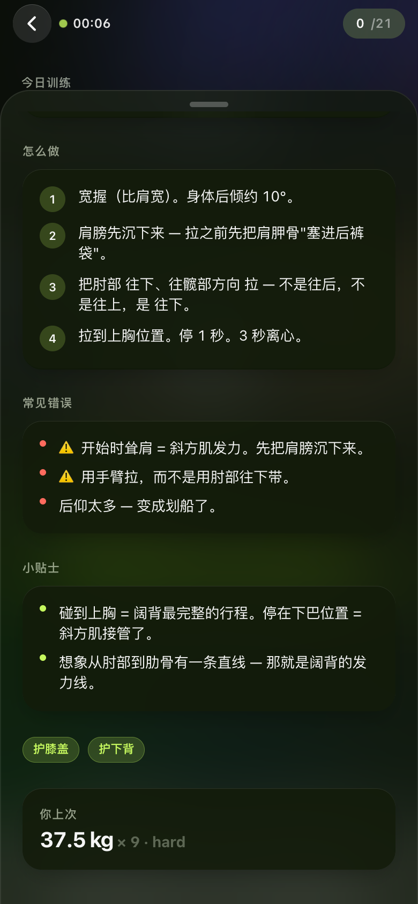
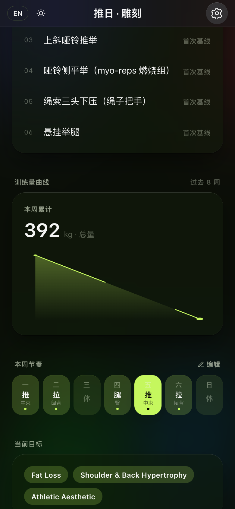
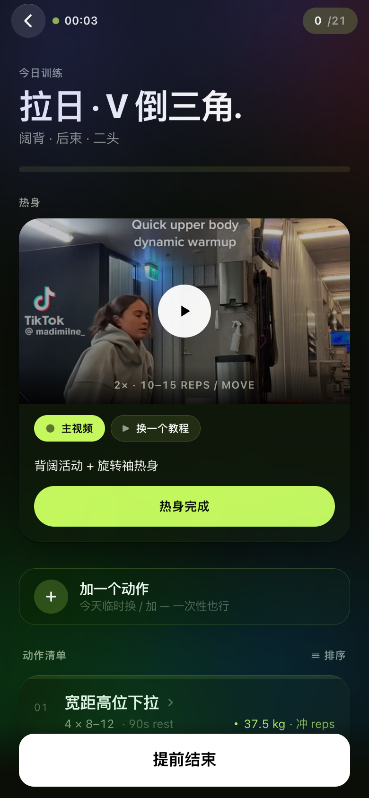
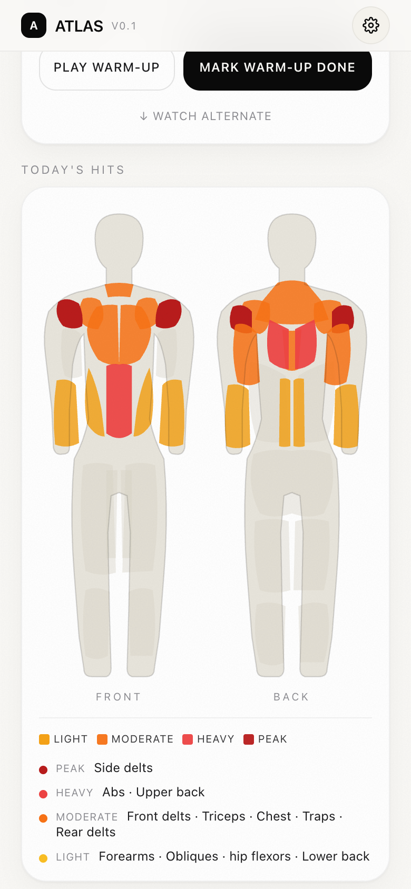

# ATLAS — AI Workout Companion

> **Live:** [atlas.skylarnyc.com](https://atlas.skylarnyc.com/?v=2) · **Free · PWA · Offline-first · No login**

<p align="center">
  
  
  
</p>

**EN.** A mobile-first training companion that behaves like a coach, not a logbook.
It knows *why* every exercise is in your plan, shows the exact short-form tutorial
for the variant you're actually doing (machine ≠ cable ≠ dumbbell), recommends your
next working weight from a tested double-progression engine, and keeps every rep
you've ever logged in versioned, exportable local storage. Wrapped in an
acid-lime-on-olive **neon** aesthetic with liquid-glass panels.

**中文.** 一个像教练而不是记事本的移动端训练搭子。它知道计划里每个动作*为什么*存在；
你练哪个变体（器械 ≠ 绳索 ≠ 哑铃）就给哪个变体的短视频教学；下一组该上多少重量，
由一套**有 19 个测试锁死的双重渐进算法**替你算好；每一组记录都存在带版本号、可导出迁移的
本地存储里。整套 UI 是酸性荧光绿 × 橄榄黑的 **neon** 液态玻璃风。

---

## ⚡ Quick start / 快速开始

```bash
git clone https://github.com/SkylarWJY/ai-workout-companion.git
cd ai-workout-companion
npm install
npm run dev        # → http://localhost:5173/?v=2
```

**Or on your phone:** open [atlas.skylarnyc.com/?v=2](https://atlas.skylarnyc.com/?v=2)
→ Safari Share → **Add to Home Screen**. Native-feel PWA, works offline.

**手机上：**Safari 打开 [atlas.skylarnyc.com/?v=2](https://atlas.skylarnyc.com/?v=2)
→ 分享 → **添加到主屏幕**，全屏无浏览器栏，离线可用。

---

## ✨ What makes it different / 它不一样的地方

### 1 · Per-variant coaching, not generic descriptions / 每个变体独立教学


Every exercise carries swappable variant chips — machine / cable / dumbbell /
barbell — and switching a chip swaps the **entire coaching block**: the tutorial
video, the why-it-matters, the how-to steps, the common mistakes, the tempo cues.
An orange **★ Best Pick** marks the editorially-chosen variant per target muscle.
Every video is a verified 1–3 minute short-form clip (DeltaBolic / Jeff Nippard
style) — never a 10-minute lecture mid-set. A build-time validator guarantees no
two chips within an exercise ever point at the same video.

每个动作带可切换的变体 chip（器械 / 绳索 / 哑铃 / 杠铃），点一下**整块教学内容跟着换**——
视频、为什么重要、动作要领、常见错误、节奏口令全部切换。每块目标肌肉有一个橙色
**★ 最佳选择**。所有视频都是验证过的 1–3 分钟短教学（不会训练到一半让你看 10 分钟讲座）。
构建期校验器保证同一动作内不会出现两个 chip 指向同一条视频。

<br clear="right" />

### 2 · A progression engine you can trust / 可信赖的渐进算法



The next-weight recommendation runs a classic **double-progression** model:
add weight only after breaking the rep ceiling, hold and chase reps inside the
range, auto-deload 10% below the floor. It anchors on your **top set** (not your
last back-off set), converts kg⇄lb per-log, respects variant boundaries, and
rounds to real plate increments — 0.5 kg micro-plates for lateral raises, 5 kg
jumps for leg press. **All 19 behavioral branches are pinned by tests that run
before every build.** If the math ever regresses, the deploy fails.

下一组配重推荐是标准**双重渐进**：突破次数上限才加重，区间内保持重量冲次数，
低于下限自动降重 10%。锚定你的 **top set**（不是最后的减重组），逐条记录做 kg⇄磅换算，
变体之间互不串数据，加重按真实杠铃片规格取整——侧平举 0.5 kg 微调，腿举 5 kg 大步。
**19 条行为分支全部被测试钉死，每次构建前必跑**——算法退化 = 部署直接失败。

<br clear="right" />

### 3 · Your data is yours / 数据完全属于你

No account, no server, no tracking. Everything lives in localStorage — made safe
by a **versioned backup system**: Settings → 备份/恢复 exports one JSON snapshot;
import replays a migration ladder, so even backups from older schema versions
(including the original v0.8 export format) restore cleanly on any domain, any device.

无账号、无服务器、无跟踪。数据全在 localStorage —— 配套**带版本号的备份系统**：
设置 → 备份/恢复 一键导出 JSON 快照；导入时自动跑迁移阶梯，旧版本格式（包括最早的
v0.8 导出）也能在任何域名、任何设备上完整恢复。

### 4 · The classics / 经典功能都在

- **1899 Bouglé anatomical body map** painted with today's per-muscle intensity
  · 1899 年 Bouglé 解剖图叠加当日肌肉训练强度
- **Warm-up & cool-down sequences** with timed holds and L/R auto-flip
  · 暖身 / 拉伸流程，计时保持 + 左右侧自动切换
- **Immersive rest & work overlays** — full-screen drain-ring countdowns
  · 全屏沉浸式组间休息 / 做组倒计时
- **Customizable weekly split** — tap-to-cycle any day between Push / Pull / Leg / Rest
  · 周计划自由编辑，点格子循环 推 / 拉 / 腿 / 休
- **Full bilingual** EN / 中文 down to per-exercise coach notes
  · 全量中英双语，细到每个动作的教练备注

<p align="center">
  
  
  
</p>

---

## 🎨 Three themes / 三套主题

| Light | Dark | **Neon** |
|---|---|---|
| Warm-white liquid glass | OLED black + aurora | Acid lime `#C5F75E` on olive black |

Cycle from the sun/moon toggle in the nav. Neon re-tints **every** token —
charts, set chips, rings, variant pills — through CSS variables resolved at
render time, so no component ever hard-codes a color.

导航栏太阳 / 月亮按钮循环切换。Neon 主题通过运行时解析的 CSS 变量重染**所有**颜色
token——图表、组数 chip、进度环、变体胶囊——没有任何组件硬编码颜色。

---

## 🏗 Engineering / 工程

```
prebuild gate:  variant audit → 5-check data validator → 25 tests → build
```

- **React 18 + Vite + Tailwind + Framer Motion**, no backend
- **Typed state setters** (`setExerciseField` / `setWorkoutOrder` / …) — the
  shape-generic API that once caused a black-screen bug now refuses invalid writes
- **Cross-file data validator**: exercise truth spans four modules; five build-time
  checks (fallback-map sync, video resolvability, distinct variant videos, zh
  completeness ×2) make drift unshippable
- **25 tests** across the progression engine and the backup / migration system
- **Schema-versioned storage** with a migration ladder for painless upgrades

```
状态层：具名 setter 钉死写入形状（曾经导致黑屏的泛型 API 现在直接拒绝非法写入）
数据层：动作数据分布在 4 个模块，5 项构建期一致性检查让漂移无法上线
测试层：渐进算法 + 备份迁移共 25 个测试，prebuild 必过
存储层：schema 带版本号 + 迁移阶梯，升级永不丢数据
```

---

## 📜 Version history / 版本历史

- **v1.0** — Neon theme · coach plan with zero muscle-overlap split ·
  per-variant verified videos · tested progression engine · versioned
  backup / restore · build-time data validators
- **v0.8** — double progression, session history, body map calibration
- **v0.5** — overrides system, weight units, goals editor
- **v0.3** — warm-up / cool-down, tempo coaching, YouTube tutorials

## 🙏 Credits / 致谢

Tutorial clips by **Andrew Kwong (DeltaBolic)**, **Jeremy Ethier**, and the
other creators credited in-app — all verified via YouTube oEmbed.
Anatomical plates by **Julien Bouglé** (1899), public domain.

## 📄 License

MIT
